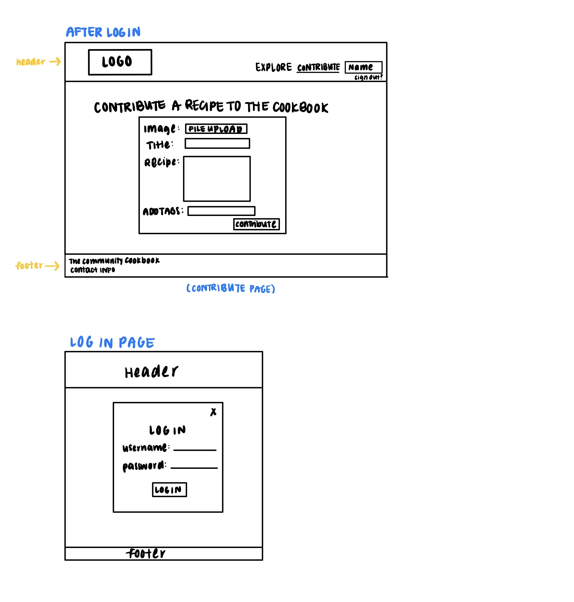

# Project 3: Design Journey

Be clear and concise in your writing. Bullets points are encouraged.

**Everything, including images, must be visible in Markdown Preview.** If it's not visible in Markdown Preview, then we won't grade it. We won't give you partial credit either. This is your warning.

## Design Plan

### Project 1 or 2

> Do you plan to reuse your Project 1 or 2 site?
> Which project?

No

> If yes, please include sketches of the site's current design (you may copy the "final" sections from those assignments.)

N/A

### Describe your Media Catalog (Milestone 1)

> What will your collection be about?
> What type of media will your site display? (images, videos, audio)

I plan on creating a "Community Cookbook" in which members of the website may contribute recipes (and images of the food they make) to the catalog. Each recipe item will include an image of the food and a text description of how to make it (the recipe!).

### Audiences (Milestone 1)

> Briefly explain your site's audiences. Be specific and justify why each audience is appropriate for your site.
> You are required to have **two** audiences: "information consumers" and "site administrators"

Information Consumer: Those who like cooking are interested in finding new recipes. The information consumer does not need access to contribute new recipes to the cookbook. They are often inexperienced cooks and will use the website to browse for recipes more often than they will want to contribute.

Site Administrator: Those who are good at cooking and are willing to share exchange recipes with a community of users. The "Site Administrator" is a user who is an experienced cook, though they can be amateur cooks as well, who wishes to share family recipes on the website. Site Administrators will gain access to the "contribute a recipe" function upon logging in.

### Personas (Milestone 1)

> Your personas must have a name and a "depiction". This can be a photo of a face or a drawing, etc.
> There is no required format for the persona.
> You may type out the persona below with bullet points or include an image of the persona. Just make sure it's easy to read the persona when previewing markdown.
> Your personas should focus on the goals, obstacles, and factors that influence behavior of each audience.

> Persona for your "consumer" audience:


> Persona for your "administrator" audience:


### Site Design (Milestone 1)

> Document your _entire_ design process. **We want to see iteration!**
> Show us the evolution of your design from your first idea (sketch) to the final design you plan to implement (sketch).
> Show us the process you used to organize content and plan the navigation, if applicable (card sorting).
> Plan your URLs for the site.
> Provide a brief explanation _underneath_ each design artifact. Explain what the artifact is, how it meets the goals of your personas (**refer to your personas by name**).
> Clearly label the final design.

I have determined that I will need to include a login page, a catalog, filter/sort/search functions on the catalog, option to insert into the catalog, sign out function. I document the card sorting process below.


I think I will choose the 4th card sort, which requires some content to be hidden from users who have not logged in yet. This would improve the user experience because users who do not have an account fall under my "consumer audience" (like Amy), and will likely not need the "insert record" or "sign out" functions that users who do have an account (Anne) need. Though I have decided, since I first created this card sort, to make the "insert" or "Contribute" link visible to all logged in users (i.e. Anne) in the navigation bar. This may make the website easier for Anne to use.

Next, I plan out possible catalog designs:


I think I will choose the 3rd design because it provides users like Amy with just enough information she needs as she browses through the catalog. If she is interested by a certain item in the catalog, she can click on the tile to reveal more information, such as the specific steps of the recipe. This will not crowd the page with too much information and create a nice, clean interface for Amy.

URL Planning:
| Page | URL |
| ------------- |:-------------:|
| home.php | / or /explore or /home|
| recipe.php | /explore/view |
| contribute.php | /contribute |
| login.php | /login |

Final Website Design

Below are images of the website design I am actively considering:



### Design Patterns (Milestone 1)

> Write a one paragraph reflection explaining how you used the design patterns in your site's design.

I designed my website with my two audiences, Amy and Anne in mind. Amy wishes to be able to eat healthy and cook for herself amidst her busy lifestyle. She may not initially want to, or need to, be able to contribute to the cookbook and only needs to search/filter through the cookbook. In response to this, I made the option to contribute to the cookbook a "log-in only" option. Without logging in, Amy can search and filter through the different recipes on the website easily. Therefore, I organized the search and filter forms inside one div element next to the catalog for Amy's convenience. I also plan on including a feature where clicking on a specific tile or recipe item will bring up a larger page with the full recipe for Amy to follow. This makes the website look cleaner as Amy browses, and she only has to actually look through recipes that she is interested in.

Anne on the other hand, is a seasoned, but amateur cook. She likes to cook in her free time and try out different recipes. Anne can create an account and login to the website. After logging in, she can see everything that Amy sees on the website, but with an added option to contribute to the cookbook. Clicking on the "Contribute" link in the nav bar will direct her to a page to fill out a form with the necessary information for a recipe "tile".

Anne may also choose to tag the recipes she posts to make it easier for Amy to identify and find. For example, Anne may wish to tag her recipe as "Easy," for "easy to make." Amy, then, may filter by recipes tagged with "easy" to find quick recipes to make.

For each audience, the available features are directly related to their needs.

## Implementation Plan

### Requests (Milestone 1. Revise in Milestone 2)

> Identify and plan each request you will support in your design.
> List each request that you will need (e.g. view image details, view gallery, edit book, tag product, etc.)
> For each request, specify the request type (GET or POST), how you will initiate the request: (form or query string URL), and the HTTP parameters necessary for the request.

- Request: view all recipes

  - Type: GET
  - URL: /explore or /
  - Params: None; SELECT \* FROM recipes

- Request: view recipe details

  - Type: GET
  - URL: /explore/view?id=X
  - Params: recipe ID

- Request: filter catalog by tags

  - Type: GET
  - URL: /explore/?tags=x
  - Params: tag name

- Request: log in

  - Type: POST
  - URL: /login
  - Params: username, password

- Request: edit entries

  - Type: POST
  - URL: /explore/view?id=X
  - Params: recipe_id, user id, fields to update

- Request: delete entries
  - Type: POST
  - URL: /explore/view?id=X
  - Params: recipe_id, user id

### Database Schema (Milestone 1. Revise in Milestone 2)

> Describe the structure of your database. You may use words or a picture. A bulleted list is probably the simplest way to do this. Make sure you include constraints for each field.

> Hint: You probably need a table for "entries", `tags`, `"entry"_tags` (stores relationship between entries and tags), and a `users` tables.

> Hint: For foreign keys, use the singular name of the table + \_id. For example: `image_id` and `tag_id` for the `image_tags` (tags for each image) table.

Table: users

- id: INTEGER {NOT NULL, AUTOINCREMENT, PRIMARY KEY, UNIQUE}
- f_name: TEXT {NOT NULL}
- l_name: TEXT {NOT NULL}
- username: TEXT {NOT NULL, UNIQUE}
- password: TEXT {NOT NULL}

Table: recipes

- id: INTEGER {NOT NULL, AUTOINCREMENT, PRIMARY KEY, UNIQUE}
- dish_name: TEXT {NOT NULL}
- ingredients: TEXT {NOT NULL}
- instructions: TEXT {NOT NULL}
- img_file: TEXT {NOT NULL}
- file_ext: TEXT {NOT NULL}
- source: TEXT {NOT NULL}
- user_id: INTEGER {NOT NULL, FOREIGN KEY references users(id)}

Table: tags

- id: INTEGER {NOT NULL, AUTOINCREMENT, PRIMARY KEY, UNIQUE}
- tag_name: TEXT {NOT NULL}

Table: recipe_tags

- id: INTEGER {NOT NULL, PRIMARY KEY, AUTOINCREMENT, UNIQUE}
- tag_id: INTEGER {NOT NULL}
- recipe_id: INTEGER {NOT NULL}

### Database Query Plan (Milestone 1. Revise in Milestone 2)

> Plan your database queries. You may use natural language, pseudocode, or SQL.

1. Display all records

```
SELECT *, COUNT(recipe_tags.recipe_id) as num_tags FROM recipes INNER JOIN recipe_tags ON recipes.id=recipe_tags.recipe_id INNER JOIN tags ON recipe_tags.tag_id=tags.id GROUP BY recipes.id";
```

2. Insert new recipe

```
if user is logged in {
  INSERT INTO
    recipes (dish_name, ingredients, instructions, img_file, file_ext, source, user_id)
  VALUES (A, B, C, D, E, F, G);

  INSERT INTO recipe_tags (tag_id, recipe_id) VALUES (A, B);

  upload file, name as id.file_extension, and move to /public/uploads folder
}
```

3. Edit recipe

```
if user is logged in {
  if user posted this recipe (i.e. check $current_user['id'] == $recipe['user_id']){
    UPDATE recipes SET dish_name = A, ingredients = B, instructions = C, source = D WHERE (id = "this recipe id");

    if add new existing tag {
      INSERT INTO recipe_tags (tag_id, recipe_id) VALUES (A, B)
    }

    if add new non-existing tag {
      INSERT INTO tags (tag_name) VALUE (A)
      INSERT INTO recipe_tags (tag_id, recipe_id) VALUE (A, B)
    }

    if remove tag {
      DELETE FROM recipe_tags WHERE recipe_id = "this recipe id" AND tag_id = "tag to delete id";
    }
  }
}
```

4. Filter through recipes by tags

```
SELECT *, COUNT(recipe_tags.recipe_id) as num_tags FROM recipes INNER JOIN recipe_tags ON recipes.id=recipe_tags.recipe_id INNER JOIN tags ON recipe_tags.tag_id=tags.id WHERE tag_name = A GROUP BY recipes.id
```

5. Delete recipe

```
if user is logged in {
  if user posted this recipe {
    DELETE FROM recipes WHERE id = A
    DELETE FROM recipe_tags WHERE recipe_id = B
    unlink image file
  }
}
```

### Code Planning (Milestone 1. Revise in Milestone 2)

> Plan any PHP code you'll need here using pseudocode.
> Use this space to plan out your form validation and assembling the SQL queries, etc.
> Tip: Break this up by pages. It makes it easier to plan.

```
// HOME.PHP:
// SEARCHING - in /explore
initialize search params to be NULL

if something searched {
  trim $_GET['search'], set search params to be used in sql query

  if search param not empty, append to base sql query (...WHERE ((dish_name LIKE '%' || :search || '%')
    OR (ingredients LIKE '%' || :search || '%'))")

  set sticky_search variable

}

// FILTERING - in /explore
initialize empty array to hold sticky array values

if APPLY FILTER {
    GET 'tags' field from URL

    foreach tag in tags table {
      check if tag is equal to the tag to filter on
      if ($tag = $target_tag) {
        then filter on this tag
      }
    }

    if there is a tag to filter on and it is not "none" {
      build $filter_exprs
    }
}
append $filter_exprs to base sql query

// RECIPE.PHP:
// EDIT POST - in /explore/view?edit=x
if user is logged in AND user posted this recipe (recipe.user_id = (this user).id) {
  if (input values are valid) {
    assemble sql update query: UPDATE recipes SET X = Y

    if (new (existing) tag added) {
      insert new tag name, recipe id into recipe_tags
    }

    if new (non-existing) tag added {
      insert new tag name into tags
      insert new tag name, recipe id into recipe_tags
    }

    if tag deleted {
      delete from recipe_tags where recipe_id = "this recipe id"
    }
  }
  else { display all current data as "sticky values" of "insert" form }

//DELETE RECIPE - in /explore/view?edit=x
if user is logged in AND user posted this recipe (recipe.user_id = (this user).id) {
  get id of the post to be deleted

  if the user_id corresponding to that post is this user{
    delete post with this recipe id from recipes table
    delete all posts with this recipe id from recipe_tags table
    unlink image
  }
}

// CONTRIBUTE.PHP
// INSERTING RECIPE - in contribute.php
if user is logged in && if insert form submitted {
  check if form inputs are valid

  if form valid {
    insert recipe values into recipes
    insert recipe tag relationships into recipe_tags

    if new (non-existing) tag added {
      insert new tag name into tags
      insert recipe tag relationships into recipe_tags
    }
  }
}
```

## Submission

### Audience (Final Submission)

> Tell us how your final site meets the needs of the audiences. Be specific here. Tell us how you tailored your design, content, etc. to make your website usable for your personas. Refer to the personas by name.

My website meets Amy's needs because it is aesthetically pleasing and easy to navigate. Someone like Amy, who is only just learning to cook, will find the ability to search through the recipes by ingredients, by name, or filter by food type (i.e. by tags) to be very useful as she is browsing through the available recipes. Because Amy is an inexperienced cook, she will not need to contribute recipes often. Thus, I have hidden the "Contribute" link from her, to make the website simpler for her, and more adapted to her needs.

Additionally, my website also meets Anne's needs. Anne is an experienced cook and she is willing to share recipes with a community of users. The "Contribute" button allows her to add recipes to the Community Cookbook easily. Anne also has the ability to edit posts that she created to correct typos, add tags, clarify instructions, or to delete the recipe entirely.

### Additional Design Justifications (Final Submission)

> If you feel like you haven’t fully explained your design choices in the final submission, or you want to explain some functions in your site (e.g., if you feel like you make a special design choice which might not meet the final requirement), you can use the additional design justifications to justify your design choices. Remember, this is place for you to justify your design choices which you haven’t covered in the design journey. You don’t need to fill out this section if you think all design choices have been well explained in the design journey.

Although I was unable to make the search and filter functions on the home page work simultaneously, they do work separately. For example, if you search for "salad" and filter by tag "Soups Salads," no results will come up. But searching "salad" and filtering by tag "Soups Salads" separately, will return relevant results. Therefore, I decided to add separate buttons for search and filter, (instead of one button, "apply" for both fields) to improve the usability of the page.

### Self-Reflection (Final Submission)

> Reflect on what you learned during this assignment. How have you improved from Project 1? What things did you have trouble with?

Since Project 1, I think that I have a deeper understanding of how PHP, as a programming language works, and how we can use it to create dynamic websites. I've also used var_dump() a lot more frequently during this project to help me debug, and I am starting to truly understand how helpful it can be. Additionally, I think that I am better at understanding the error messages that may show up in the PHP console, and they give me an idea on how to fix my code!

I had a lot of trouble with displaying tags properly in this assignment, and writing SQL queries, more so than Project 2. Adding JOINS clauses to queries certainly complicates the logic to writing queries, and it is difficult to think about how to combine tables to get the data that I am looking for. Overall, I thought that this project was an interesting challenge.

### Grading: Mobile or Desktop (Final Submission)

> When we grade your final site, should we grade this with a mobile screen size or a desktop screen size?

Desktop

### Grading: Step-by-Step Instructions (Final Submission)

> Write step-by-step instructions for the graders.
> The project if very hard to grade if we don't understand how your site works.
> For example, you must login before you can delete.
> For each set of instructions, assume the grader is starting from /

Logging in:

1. Use the "LOG IN" button in the navigation bar.
2. Some username/password combinations you may wish to try include flavor123/monkey; cook123/monkey; mpollack5/monkey. Note that the edit button for recipes appears depending on whether the currently logged in user was the one who contributed the recipe. So logging in with flavor123/monkey will allow you to edit the "Lemon Ricotta Pasta and Spinach" post, but nothing else. See init.sql to see which user posted which recipe.

Viewing all entries:

1. No action needed; The user does not need to log in to view all entries

View all entries for a tag:

1. In the red box on the left hand side, select the tag you wish to filter on (drop down menu under "Filter By Tags:")
2. Click "Apply" to view all entries for that tag
3. Select "--Select--" or "Clear" to clear tag filters

View a single entry and all the tags for that entry:

1. From the Explore page, click "Get the Recipe!" to view the recipe

How to insert and upload a new entry:

1. Login using the "Log In" button in the navigation bar
2. Log in using a username and password (monkey) combination from init.sql. (Ex. username=big_red123, password=monkey)
3. A "Contribute" link will appear in the navigation bar
4. Click "Contribute" to insert and upload a new entry

How to delete an entry:

1. From the explore page, click on an entry that you uploaded. (Ex. User flavor23 uploaded the "Lemon Ricotta Pasta and Spinach" post)
2. Click "Get Recipe"
3. Click "Edit"
4. Click "Delete"

How to view all tags at once:

1. You can see the list of tags from the explore page, through the filter dropdown menu.

How to add a tag to an existing entry:

1. From the explore page, click on an entry that you uploaded. (Ex. User flavor23 uploaded the "Lemon Ricotta Pasta and Spinach" post)
2. Click "Get Recipe"
3. Click "Edit"
4. Scroll down. You will see the option to create a new tag. Enter the name of a tag into that field to add a new tag. Otherwise, you may choose from a list of existing tags.
5. Click "Update" to add the tag.

How to remove a tag from an existing entry:

1. From the explore page, click on an entry that you uploaded. (Ex. User big_red123 uploaded the "Peanut Butter Banana Smoothie" post)
2. Click "Get Recipe"
3. Click "Edit"
4. Scroll down. You will see the option to remove a tag. You may choose a tag from the dropdown menu of tags that your post is currently tagged with. You may only remove one tag at a time.
5. Click "Update" to remove the tag.
